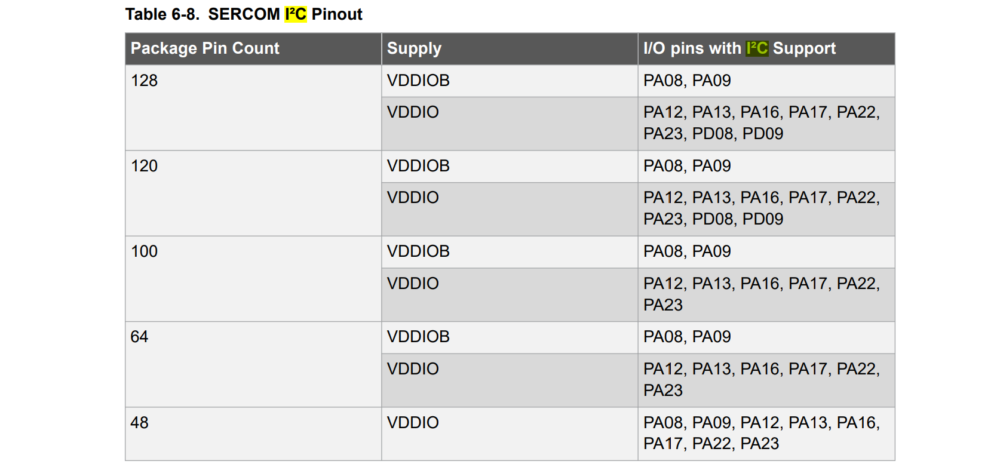

# MCU-SwissSolarBoat
written by : Baptiste Savioz, the 03.03.2022  
reviewed by : ..., the .. .. ....  
updaten by : ..., the .. .. ...  

# Introduction
This repository contains all required files and information for complete characterization of the main MCU-board of Swiss Solar Boat. Please read the documentation carefully before starting, especially the _Important things before starting_ section.

The main MCU-board is made of a powerfull microcontroller used for communication (based on the CAN protocol) between the differents modules of the boat. It also includes I2C lines with dedicated connectors for communication insides boat modules (eg. the battery box) and a SD card holder to save a logfile for example.

# ! Important things before starting !

# Documentation

## Sub-system characterization
### MCU
The board is based on [ATSAME51J20A-AF](https://www.mouser.ch/datasheet/2/268/60001507E-1660031.pdf) MCU from atmel, using the 32-bit ARM® Cortex®-M4 processor with Floating Point Unit (FPU). It is running at 120 [MHz] on 3.3[V].
* **Reset Pin** the reset pin is low active and powered-up trough a low pass RC filter as recommanded for design in noisy environnement. Moreover, it's connected to a push button for manual reset.
* **Power Pins** The power pins are wired according to typical power connection for switching mode power supply, with a feartite bead for high frequency isolation and EMC.

### Power supply
The board is powered with a 24[V] DC line that goes all along the boat. It can be quite noisy and therefore we choosed to graduatly decreased the voltage from 24[V] to 5[V]  through a high efficiency buck converter and then from 5[V] to 3.3[V] with a LDO IC. The LDO will power only the main board to ensure stable and clean power to it. On the other hand, the 5[V] power supply can be used by the shield to power other small devices. 

 * **Buck converter** : 24[V] DC to 5[V] DC  
The buck used is the [TPS54233QDRQ1](https://www.ti.com/lit/ds/symlink/tps54233-q1.pdf?HQS=dis-mous-null-mousermode-dsf-pf-null-wwe&ts=1646666212563&ref_url=https%253A%252F%252Fwww.mouser.ch%252F) from texas instrument. It has been designed with WEBENCH software from TI to operate at 20-28[V] in, 5[V] out, 2[A] out max, 50[°C].  
https://webench.ti.com/power-designer/switching-regulator?powerSupply=0

 * **LDO** : 5[V] DC to 3.3[V] DC    
 The LDO used is the [AP7365-33WG-7](https://www.diodes.com/assets/Datasheets/products_inactive_data/AP7365.pdf), which is a fixed output voltage LDO in the package SOT25. It not recommanded for new design and will shortly full out of supply. The newer version AP7366 is available but haven't been choosen because parts weren't available for now. However, switching to AP7366 wouldn't required adaptation of the PCB since it is also in the SOT25 package. Further update of this PCB may want to upgrade the LDO to an up to date version.

### Clock
The MCU has several clocking options and can admit two external oscillators (32768[Hz] for real time counting applications RTC and higher frequency oscillators). By default it is running at 48[MHz] on internal oscillators. Only the RTC oscillators is mounted on the board. It is a 32768[Hz] oscillators with low load capacitance (9[pF]) [Q 0,032768-JTX310-9-20-T1-HMR-LF](https://www.jauch.com/downloadfile/57fde22d50dbf_d3c203011c87952f2834/jtx310-auto-2-210512.pdf) connected to pin PA0 and PA1 (XIN32, XOUT32).
Hz
### Communication
* **CAN** : The MCU comes with two built-in CAN controller which will be both used. The CAN tranciever [TCAN337GDR](https://www.ti.com/lit/ds/symlink/tcan337g.pdf?ts=1646566581440&ref_url=https%253A%252F%252Fwww.ti.com%252Fstore%252Fti%252Fen%252Fp%252Fproduct%252F%253Fp%253DTCAN337GDR) is used to handle the CAN protocol. It's 3.3V logic, therefore the differential on the CAN bus is 3.3V. Nonetheless, the device is fully compatible with 5V differential logic. The CAN tranciver uses a serial line to communicate with the CAN controller of the MCU. m Moreover it also inlcudes a silent mode for listen only (high active) and a fault pin to indicate a failure on the device (high active). In order to use the silent mode, a solder bridge need to be fill on the board, otherwise, if silent mode is of no use, please use the other solder bridge to ground it. The fault pin needs a pull-up resistor to be mounted on the board and the solder bridge to be filled in order to be used.  Furthermore, the CAN lines are available through a [JST-S04B-PASK-2-LF-SN](https://datasheet.octopart.com/S04B-PASK-2%28LF%29%28SN%29-JST-datasheet-1807.pdf) connector (4 pins - 2mm pitch). Ground and 24V supply voltage must be connected through jumpers. One must be extra careful when connecting them to avoid connecting two differents power supply together (risk of BOUM) or different supply than 24[V], and also when connecting the ground to avoid ground loop.

|Name|Pin connected on the MCU|comment|
|----|------------------------|-------|
|RX_CAN0|PA23||
|TX_CAN0|PA22||
|S_CAN0|PA21|a solder bridge needs to be filled if one wants to connect this pin to the MCU, otherwise another solder bridge needs to be filled in order to ground it|
|FAULT_CAN0|PA20|A pull-up resistor needs to be mounted and a solder bridge to be filled if one wants to connect this pin to the MCU|
|RX_CAN1|PB15||
|TX_CAN1|PB14||
|S_CAN1|PA15|a solder bridge needs to be filled if one wants to connect this pin to the MCU, otherwise another solder bridge needs to be filled in order to ground it|
|FAULT_CAN1|PA14|A pull-up resistor needs to be mounted and a solder bridge to be filled if one wants to connect this pin to the MCU|

* **I2C** : The MCU comes with 8 SERCOM lines, that can be configured for serial communication protocol such as UART, I2C, RS232, RS485, SPI. Please carefuly check the documentation before configuring one of these protocol, they require dedicated SERCOM port. Section 6.2.8.1 may be handy. Moreover, not all SERCOM port can be used for I2C communication. The pins that support I2C communication for a 64 pins package are :  

the MCU-board comes with one dedicated I2C line. Another line has been left free for that pruposes but there is no connector mounted on the board by default.

|Name|Pin connected on the MCU|comment|
|----|------------------------|-------|
|SDA_0|PA08||
|SCL_0|PA09||  
|SDA_1|PA13|*no connector mounted on the main-MCU board, a dedicated shield is necessary to use that line*|
|SCL_1|PA12|*no connector mounted on the main-MCU board, a dedicated shield is necessary to use that line*|  

It's available through a [JST-S04B-PASK-2-LF-SN](https://datasheet.octopart.com/S04B-PASK-2%28LF%29%28SN%29-JST-datasheet-1807.pdf) connector (4 pins - 2mm pitch). The power supply line is at 3.3[V] and is connected to the connector through a jumper. It must absolutely be deconnected if pluged to a device with its own power supply (even if it's 3.3[V]). Moreover, one must be careful when connecting the ground, in order to avoid ground loop.

* **JTAG** : The MCU has a JTAG debugging standard built-in. The connections is made through a 10 (2x5) male pin headers connector with 1.27[mm] pitch : [FTSH-105-01-L-DV-K](http://suddendocs.samtec.com/catalog_english/ftsh_smt.pdf).  

 
* **USB** : the MCU has a built-in USB 2.0 line. In order to be used the MCU need to be powered at 3.3[V] (min 3[V] - max 3.6[V]) and there is some restrictions on clock source and frequency, especially for USB host connections, that need to be taken into account when doing the firmware. A micro-USB B connector has been choosen for that connection. The VBUS line (5[V]) is of no use on the board and it is not further connected. The ID pin from the micro-USB B connector is by default left unconnected but there is a solder bridge jumper available on the board if it needs to be grounded (in order to host USB communication).

### Connectors
- complete list of connectors

### SD-card and memory

## exhaustive list of component
|Component|name|number|reference|general purpose|usual reseller|link|
|---------|----|------|---------|---------------|--------------|----|
|Microcontroler|ATSAME51J20A-AF|1|CMP-002-000002-1|MCU of the board|Mouser|https://www.mouser.ch/ProductDetail/Microchip-Technology-Atmel/ATSAME51J20A-AF?qs=sGAEpiMZZMv0NwlthflBi1rrhCr8J09xsoDuGmx4aqk%3D|
|Buck|---|1|---|Power supply : convert 24V DC to stable 5V DC|---|
|LDO|---|1|---|Power supply : convert 5V DC to stable 3.3V DC|---|
|Crystal|---|1|---|Frequency generation for the MCU|---|

## Pinout and Shield
pinout schematic and shield characterization

## physical adress of modules
|Module|protocol|Address|general purpose|
|------|--------|-------|---------------|
|dummy|I2C|0xfh6c|dummy module used for example|

 Repository for documentation, characteristics and all required elements for the Microcontroller board, including PCB conception, of SSB.
